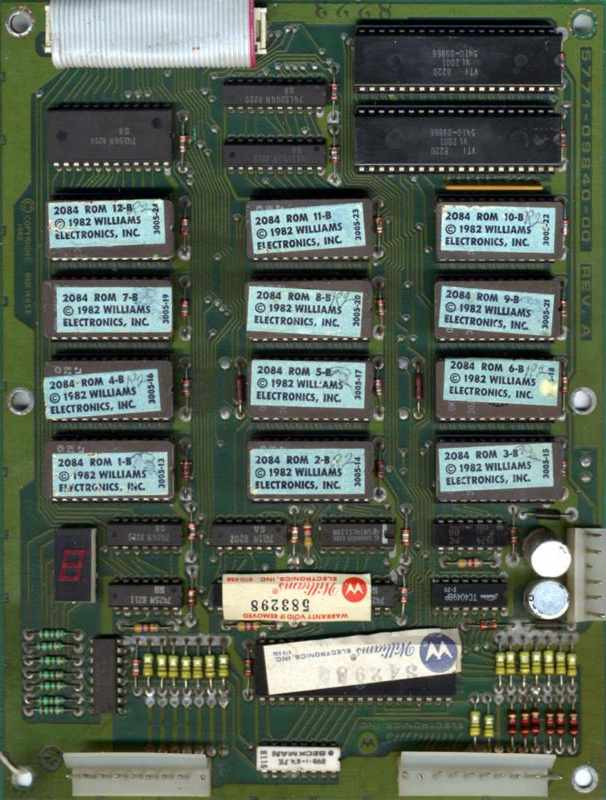

# Robotron:2084 (1982) by Eugene Jarvis


This is the source code for the Williams arcade game Robotron:2084.

The source code can be assembled into 11 rom files that would have been loaded
onto the arcade cabinet's ROM board. Today, these rom files can be used to play
the game in an emulator such as [MAME](https://www.mamedev.org/release.html).


<!-- vim-markdown-toc GFM -->

* [Build Instructions](#build-instructions)
  * [Build Requirements](#build-requirements)
  * [Build the assembler toolchain](#build-the-assembler-toolchain)
  * [Build Robotron:2084](#build-robotron2084)
* [Play Robotron:2084](#play-robotron2084)
* [About the source code](#about-the-source-code)
  * [Changes Required](#changes-required)
* [The Blue Label ROMs](#the-blue-label-roms)

<!-- vim-markdown-toc -->
## Build Instructions

### Build Requirements
```sh
sudo apt install build-essentials wine python3
```

### Build the assembler toolchain

We use [`asm6809`](https://www.6809.org.uk/asm6809/) to assembler the source code for the main game and [`vasm`](http://www.compilers.de/vasm.html) to compile
the sound module. 

First you must run the following to set up the git submodules containing the assembler toolchain:

```sh
git submodule init
git submodule update
```

Now you can build the toolchain, as follows:

```sh
cd asm6809
./autogen.sh
./configure
make 
cd ..
cd vasm-mirror
make CPU=6800 SYNTAX=oldstyle
cd ..
```

### Build Robotron:2084

To build the Blue Label rom files (see below for more information on what these are), do:
```sh
make bluelabel
```
These will get written to a directory called `bluelabel`.

## Play Robotron:2084

Once you've built robotron you can now use the rom files in the `bluelabel' directory to play robotron on [MAME](https://www.mamedev.org/release.html). If you're on Ubuntu you can also install MAME with apt:
```sh
sudo apt install mame
```

## About the source code
The game source code for Robotron:2084 in [src](src) was originally retrieved from
https://github.com/historicalsource/robotron. It is the Motorola 6809 assembly language
source code for the 'Blue Label' version of the game.

The source code for the [sound module](src/VSNDRM3.SRC) was retrieved from https://github.com/historicalsource/williams-soundroms.

### Changes Required
You can review the changes required to get Robotron to assemble with `asm6809`
in [this
commit](https://github.com/mwenge/robotron/commit/f636fd4855eb7fcb719528f12078d8976678b915).
To avoid more substantial changes I [forked
`asm6809`](https://github.com/mwenge/asm6809) to allow a lot of equivalent
instructions from the older 6800 instruction set along with a few other things
that the assembler used by Eugene Jarvis and his team allowed.

## The Blue Label ROMs
When you run `make bluelabel` you create the following files in the `bluelabel` directory:

```sh
-rw-rw-r--  1 robert robert 4096 Jul 27 21:00 robotron.sb1
-rw-rw-r--  1 robert robert 4096 Jul 27 21:00 robotron.sb2
-rw-rw-r--  1 robert robert 4096 Jul 27 21:00 robotron.sb3
-rw-rw-r--  1 robert robert 4096 Jul 27 21:00 robotron.sb4
-rw-rw-r--  1 robert robert 4096 Jul 27 21:00 robotron.sb5
-rw-rw-r--  1 robert robert 4096 Jul 27 21:00 robotron.sb6
-rw-rw-r--  1 robert robert 4096 Jul 27 21:00 robotron.sb7
-rw-rw-r--  1 robert robert 4096 Jul 27 21:00 robotron.sb8
-rw-rw-r--  1 robert robert 4096 Jul 27 21:00 robotron.sb9
-rw-rw-r--  1 robert robert 4096 Jul 27 21:00 robotron.sba
-rw-rw-r--  1 robert robert 4096 Jul 27 21:00 robotron.sbb
-rw-rw-r--  1 robert robert 4096 Jul 27 21:00 robotron.sbc
```

Each of these is a 4K file that was burned to ROM chips in the arcade game's ROM board. [This copy of the 1982 owner's manual](https://www.robotron-2084.co.uk/manuals/robotron/robotron_upright_instruction_manual_mar_82.pdf) contains a manifest
of these ROM chips:


This picture of an actual Roboton ROM board shows you where each ROM chip lives. You can see why this version was known as 'blue label': the labels on each chip are light blue. Each label tells you which ROM file the chip contained:



`robotron.sb1` was loaded to the the chip labelled '2084 ROM 1-B' in the bottom left hand corner, and then so on up to '2084 ROM 12-B' in the top left hand corner which contained `robotron.sbc`.
